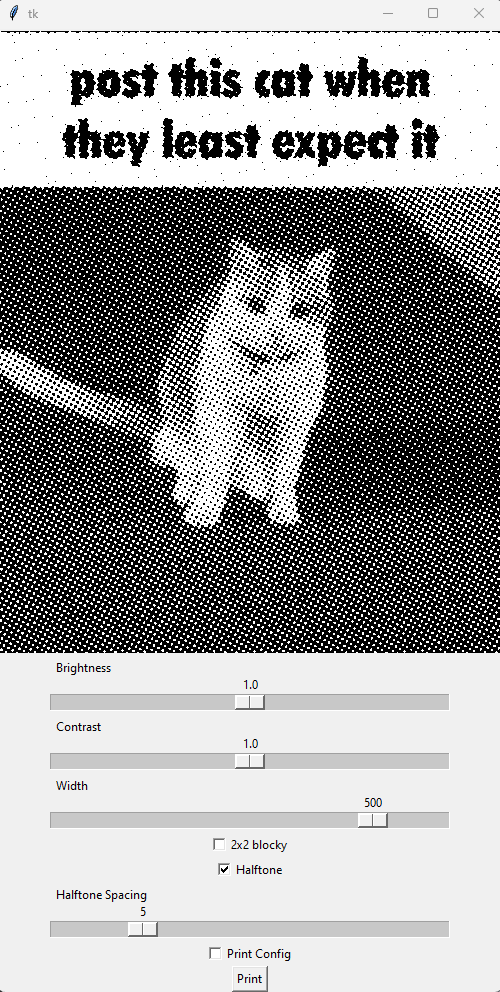
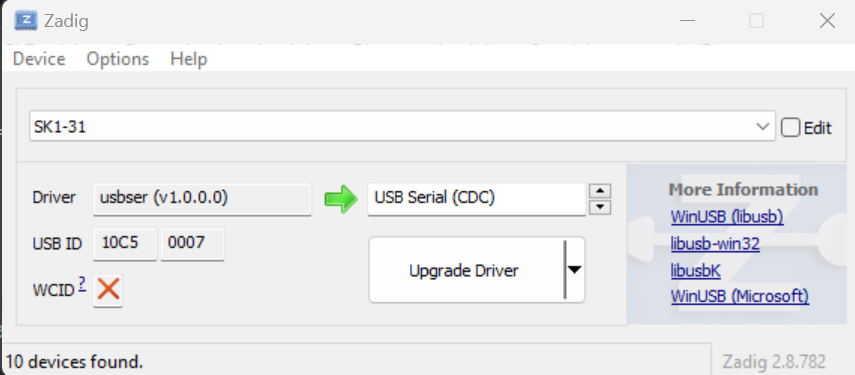

# Image Thermal Printer

The Image Thermal Printer is a simple app that enables the printing of images in dither or halftone format. This application should be compatible with most thermal printers.
Image Demonstration

Below are some images that provide a visual representation of the application:

# Setup

In order to get the printer functioning as a CDC device, you need to install Zadig. Please be aware that you will need a COM port if it does not appear with the default driver.

# Changing the COM Port

To alter the COM port, it's required to add it to the code. Detailed instructions on how to do this can be found in the user guide.
